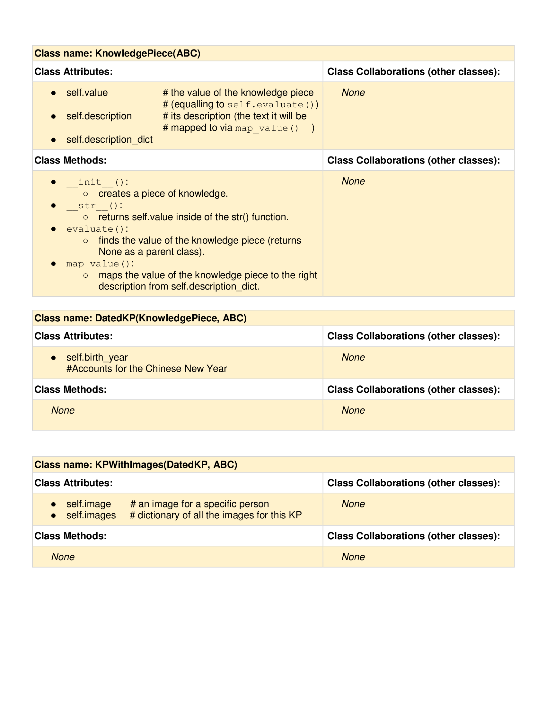
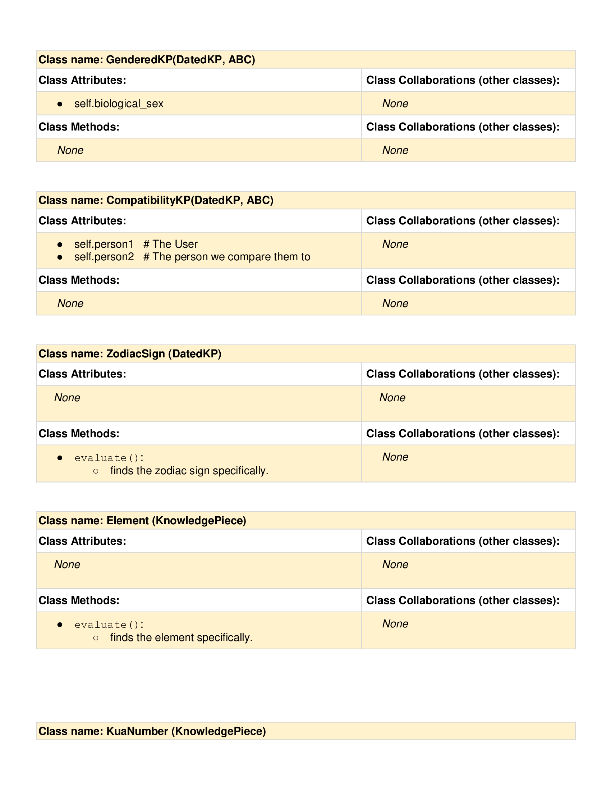
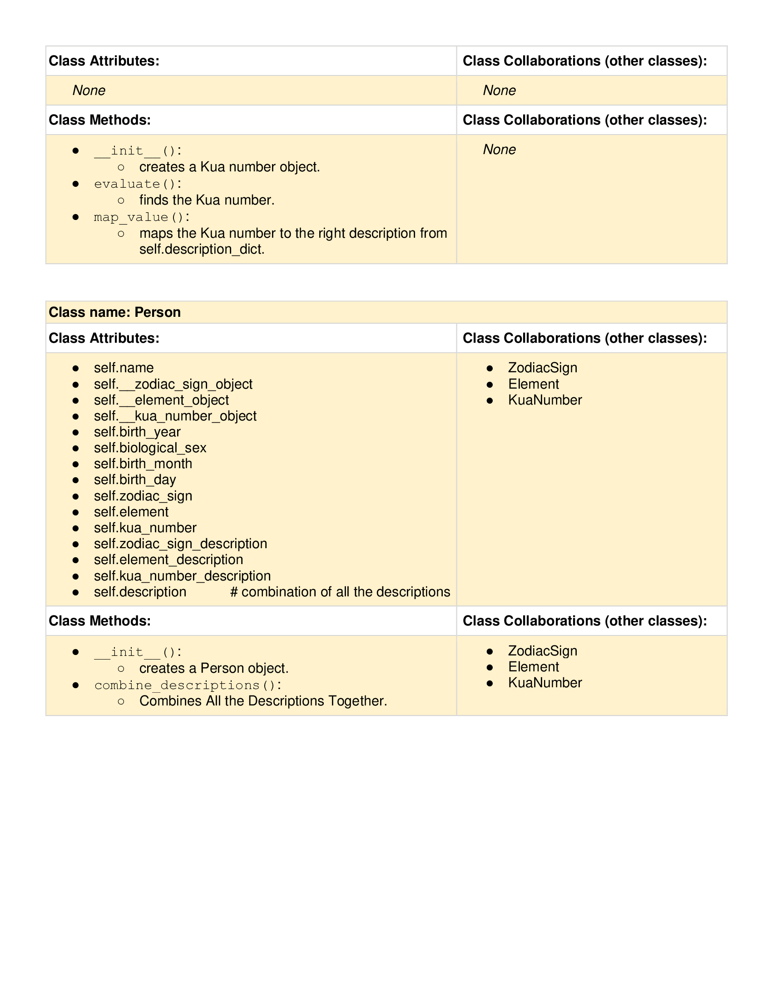
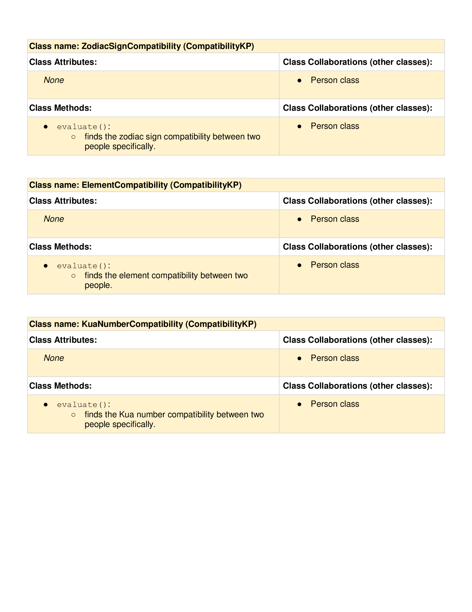
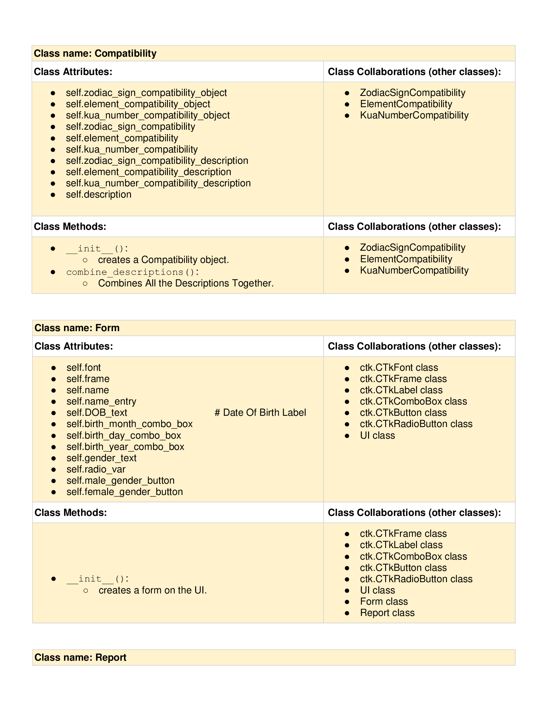
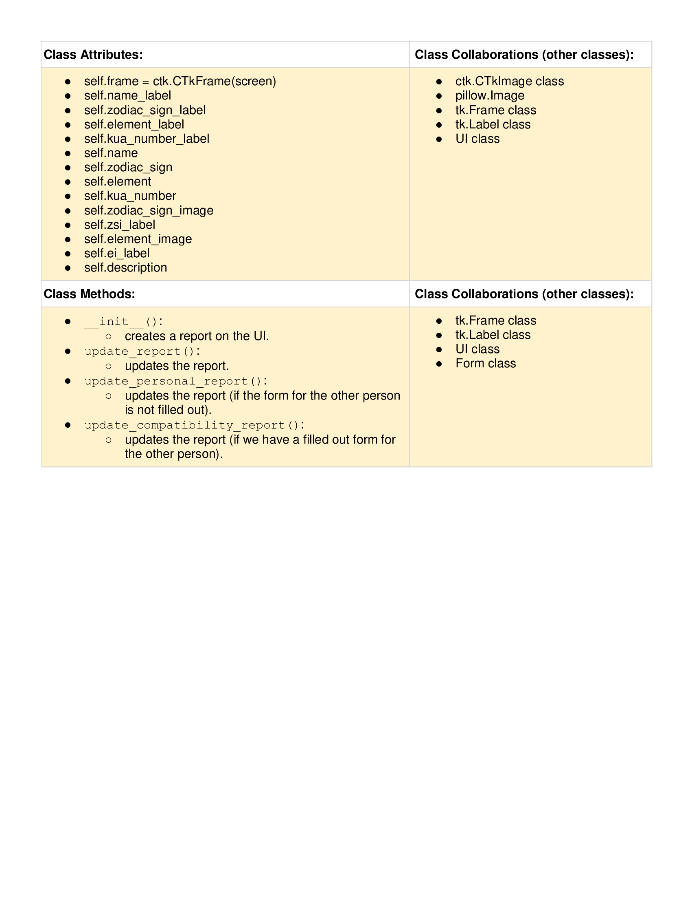
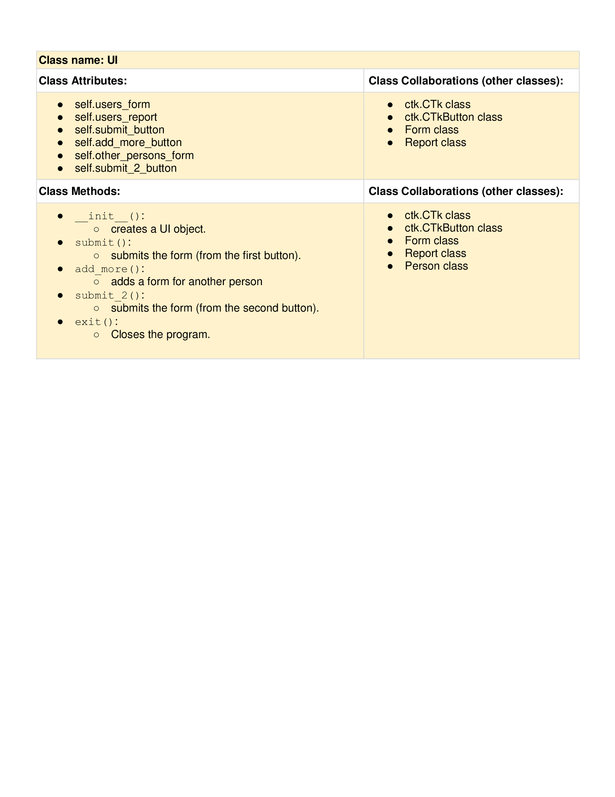

# CSC226 Final Project

## Instructions

**Author(s)**: Artem Kurasov, Pride Akana Techa

**Google Doc Link**: https://docs.google.com/document/d/1Nnn_zMXkiQrOK2F41I0CO6-Wi5TF_GXp1tDYt5-hF7M/edit?usp=sharing

---

## Milestone 1: Setup, Planning, Design

️**Title**: `Paving Your Way to Success with Chinese Metaphysics`

**Purpose**: `Through an interactive GUI and the user's input, the program displays the user's Chinese zodiac sign, 
              their element, Kua number, compatability with their friends or beloved ones, as well as tips on how to 
              set up their home space for success.`

**Source Assignment(s)**: `Homework 01: Breaking Bad`

**CRC Card(s)**:
    








**Branches**: This project will **require** effective use of git. 

```
    Branch 1 starting name: techap
    Branch 2 starting name: kurasova
```

### References 

AbstractClasses.py: 
- Used the abc module: https://docs.python.org/3/library/abc.html
- Article on how to create abstract classes: https://www.w3schools.com/python/ref_module_abc.asp
- Chinese New Year Calendars:
  - https://www.themalatree.com/chinese-new-year-dates-1930-to-2030/
  - https://greenwichmeantime.com/chinese-new-year/1950/
  - https://taiwan-database.net/PDFs/WTFpdf23.pdf
- Fixing a circular import issue that occurred in this file: https://www.youtube.com/watch?v=UnKa_t-M_kM

Element.py: 
- Article on how to evaluate your element according to Chinese Metaphysics: https://shopceremonie.com/blog1/how-to-determine-your-elements
- Article on the meanings of the various elements: https://ohcomassagechairs.com/news-recognition/shiatsu-and-the-five-elements-theory/

KuaNumber.py: 
- Video and article on how to calculate the Kua Number:
  - https://www.youtube.com/shorts/cy6r7imx4Uo
  - https://wehomzfurn.com/blogs/decoration-ideas/how-to-calculate-your-kua-number-a-complete-guide-for-2026

ZodiacSignCompatibility.py: 
- Used Wikipedia for the Zodiac Sign Compatibility table: https://en.wikipedia.org/wiki/Chinese_zodiac (Accessed on April 19, 2026)

ElementCompatibility.py: 
- Article on how to evaluate your element according to Chinese Metaphysics: https://www.yourtango.com/zodiac/chinese-zodiac-elements

KuaNumberCompatibility.py: 
- More on Kua Number Compatibility: https://www.karmaweather.com/well-being/feng-shui/bagua-kua-number

Report.py: 
- Adding Images to Tkinter: https://www.geeksforgeeks.org/python/how-to-add-an-image-in-tkinter/
- CustomTkinter Documentation: https://customtkinter.tomschimansky.com/

UI.py: 
- Website on how to use custom tkinter: https://customtkinter.tomschimansky.com/documentation/windows/window/
- Changing the background image: https://stackoverflow.com/questions/2744795/background-color-for-tk-in-python
- Disabling resizability of the window: https://www.tutorialspoint.com/article/how-can-i-prevent-a-window-from-being-resized-with-tkinter

Form.py: 
- More on the CTKFont class: https://customtkinter.tomschimansky.com/documentation/utility-classes/font/


---

## Milestone 2: Code Setup and Issue Queue

```
    - So far, we are making some progress towards the completion of the project. We're able to work as a team smoothly: we
      meet up at least twice a week to discuss the tasks we were assigned and synchronize our work, making sure that we're 
      both contributing to the project.
    - We think we're ahead.
    - We're worried about the design of the user interface.
    - Ultimately, we're feeling good about the project and working towards its effective completion.  
```

---

## Milestone 3: Virtual Check-In

️**Completion Percentage**: `76%`

️**Confidence**: 

```
    - We are very confident about completing this project because we have made great progress so far. We're currently 
      working on the UI implementation phase, and everything seems to work pretty well. Whenever we encounter a problem, 
      we are able to think through it and devise a solution. 
    - For us to successfully complete this project, we need to dedicate more time and effort to it and meet up frequently 
      to work as a team. 
```

---

## Milestone 4: Final Code, Presentation, Demo

### User Instructions

```
    After hitting the run button, a form is displayed on the GUI that prompts the user to enter their name, date of 
    birth, and biological sex. When the user fills out the form, they have the option of submitting the form or adding 
    another form. If they click on the 'submit' button, their report will be displayed on the screen. This report contains 
    their Chinese zodiac sign, element, and kua numbers, as well as their pictorial representation and descriptions. If 
    they click on the 'add more' button, another form will be displayed on the GUI that prompts them to fill out the 
    information of the person they want to compare themselves with. After filling out the new form out, they can now proceed 
    to hitting the next submit button. Following this, a compatibility report of their zodiac sign, element, and kua 
    number will be displayed on the screen. They user can read the report to determine if they are a match with the other
    person or not, which brings the user to the end of the program. 
    
```

### Errors and Constraints

- Our project required Python 3.14 and the modules Pillow and CustomTkinter.

### Reflection

```
    Partner 1: 
    The initial idea we had in mind when we started working on this project was to create a program that determines a user's 
    Chinese zodiac sign, element, and kua number, explain what each of them mean, and compare them to their beloved
    if they wish to. Also, if they are not compatible with their beloved, offer some tips that could help them live in 
    harmony. Looking at the final product we have, it is pretty much in line with what we had envisioned, except for giving
    the user tips if they are not compatible with they person they compared themselves with.
    
    Working on this project increased my communication and team work skills. Initially, I always preferred individual work,
    but this course as a whole and the project in particular made me understand the importance of effective communication 
    in teamwork and helped me to become a better team player. In regards to technical skills, this project made me relearn
    almost everything previously taught in this course, from if else statements to GUIs, and a lot more. It also enabled 
    me to better comprehend Git and GitHub, and how to use them professionally. Finally, one of the most important things 
    I learned throughout this process is the art of effective problem solving, from breaking down the problem into 
    manageable tasks to debugging.
    
    The hardest part of this project was the first step, applying top down design. It what challenging because it required
    great understanding of the project and knowledge of what the final product will look like without implementing any code.
    One thing I would have done differently is trying to understand everything on my own. Next time, I would ask my partner
    more questions about anything I do not understand and possibly seek help from TAs if still do not understand.
    
    Working with my partner was really effective because we always scheduled in-persons meetings where we dicussed our 
    ideas and made progressed together towards completing the project. Also, we closely monitored our progress and made 
    sure everyone was contributing to the project by completing their tasks on time.
```

```
    Partner 2: 
    
    As I am about to delve deeper into my feelings on our project, I would like to start off by saying that it was 
    the first major project I have shared with another person. Before the final project of CSC 226, I have worked
    on everything big completely alone (partly because of a fear that my partners can mess everything up). Therefore, 
    this project taught me to be patient, persevere, and most importantly, willing to share my vision with others. 
    I realized that when you have an idea, people can often expand it in a way you would never think of. This is the
    greatest aspect of teamwork, and this is the most important thing I have learned from this final project. 
    
    When it comes to the topic we have chosen for the final project, we decided to work on Chinese Metaphysics 
    for several reasons. Even though things like Astrology, Numerology, or Metaphysics induce a lot of anxiety, they 
    are also a fun way to learn more about yourself if you don’t take them very seriously. Besides that, we wanted 
    to create something that other people did not do (at least, in this year’s CSC 226 class), and we thought that 
    Chinese Metaphysics would not be a popular choice.
    
    Honestly, didn’t expect our final project to go as smoothly as it did, so it’s rather hard to point at a specific 
    issue that I would like to improve upon by the next project. I would say that the final project reflected the 
    initial design quite well. Nonetheless, there were some ideas that were scrapped simply because of the lack of time, 
    and the way we decided to structure the code (CRC Cards) changed drammatically over the course of the project. 
    Other than that, we achieved what we planned, and it’s a big accomplishment in-and-of itself. Nevertheless, I would 
    personally meet up more with my teammate next time but for a shorter period of time (1-3 hour sessions,
    instead of 4-5 hour ones, which is what we often had): that would just make us feel less burned out by the end. 
    Therefore, as you might have guessed, the hardest part of the project for me was the last two weeks of the final 
    project. It was mainly because of the fatigue that I often experience at the end of every project. 
    Things are getting more habitual and less interesting over time, which makes working on it more cumbersome. 
    Nonetheless, thanks to having a tenacious teammate like Pride, we got the job done!    
    
    I really enjoyed working with Pride, especially because I think that we complement one another very well. 
    I might have more experience in Python than Pride does, but at the same time, I’m very messy when it comes 
    to long-term projects because I switch around a lot and act like I have 100 tabs open in my mind. Meanwhile, 
    Pride is calmer and more organized in her thoughts than I am, so it was really nice to work with her. I didn’t 
    find anything particularly challenging in working with her. 
```

---