# CSC226 Final Project

## Instructions

❗️Exclamation Marks ❗️indicate action items; you should remove these emoji as you complete/update the items which 
  they accompany. (This means that your final README should have no ❗️in it!)

**Author(s)**: Artem Kurasov, Pride Akana Techa

**Google Doc Link**: https://docs.google.com/document/d/1Nnn_zMXkiQrOK2F41I0CO6-Wi5TF_GXp1tDYt5-hF7M/edit?usp=sharing

---

## Milestone 1: Setup, Planning, Design

️**Title**: `Paving Your Way to Success with Chinese Metaphysics`

**Purpose**: `Through an interactive GUI and the user's input, the program displays the user's Chinese zodiac sign, 
              their element, Kua number, compatability with their friends or beloved ones, as well as tips on how to 
              set up their home space for success.`

**Source Assignment(s)**: `Homework 01: Breaking Bad`

**CRC Card(s)**:
  - Create a CRC card for each class that your project will implement.
  - See this link for a sample CRC card and a template to use for your own cards (you will have to make a copy to edit):
    [CRC Card Example](https://docs.google.com/document/d/1JE_3Qmytk_JGztRqkPXWACJwciPH61VCx3idIlBCVFY/edit?usp=sharing)
  - Tables in markdown are not easy, so we suggest saving your CRC card as an image and including the image(s) in the 
    README. You can do this by saving an image in the repository and linking to it. See the sample CRC card below - 
    and REPLACE it with your own:
  
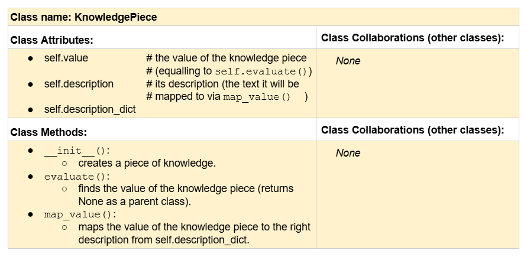

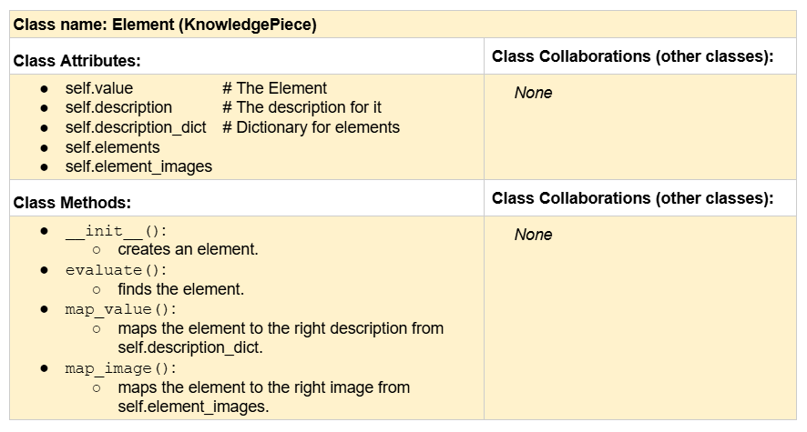
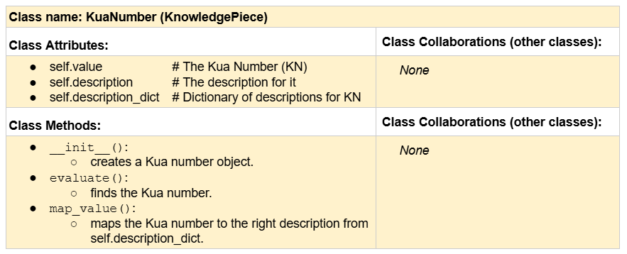
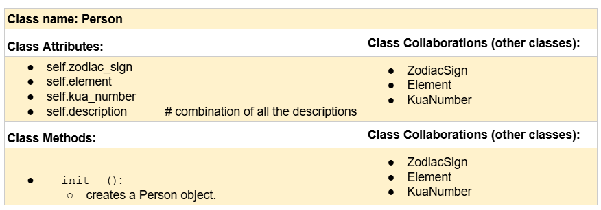
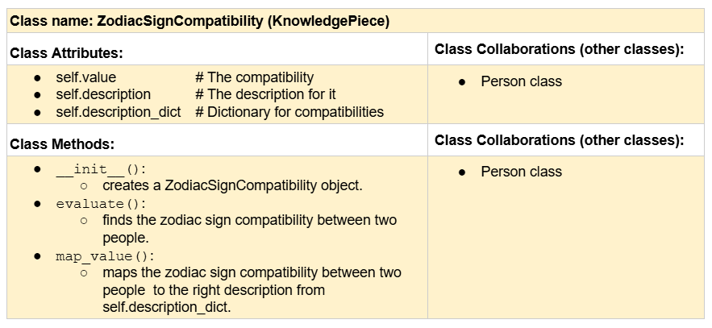
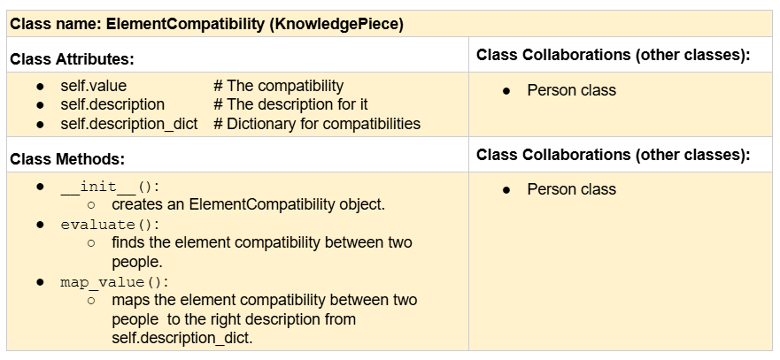
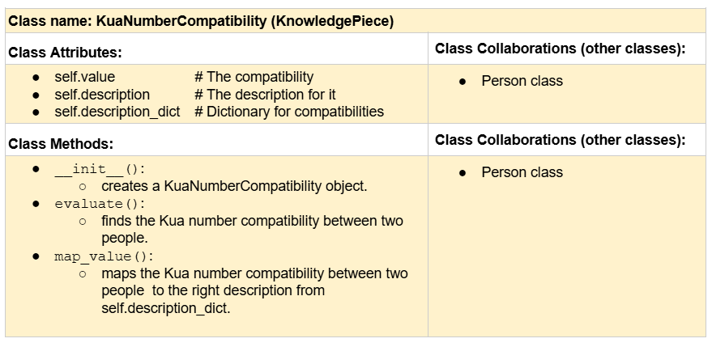
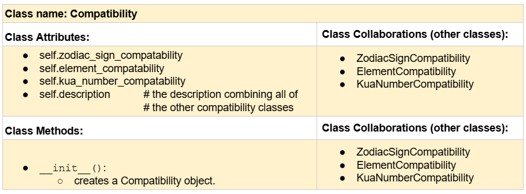
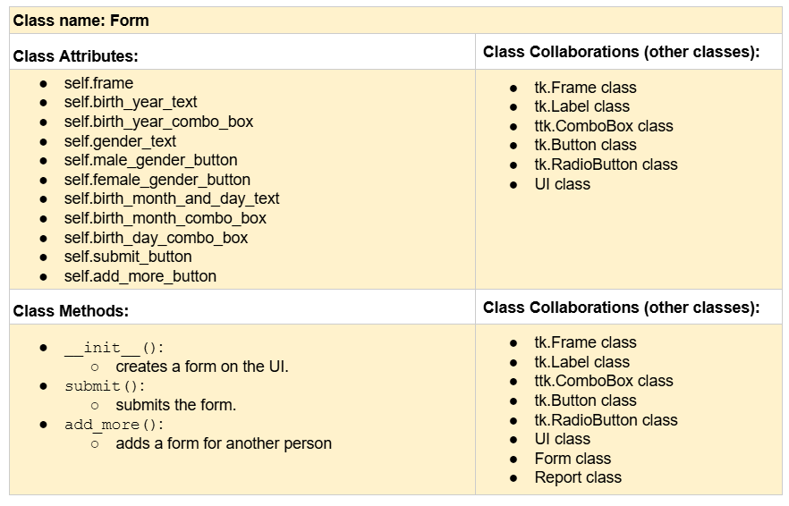
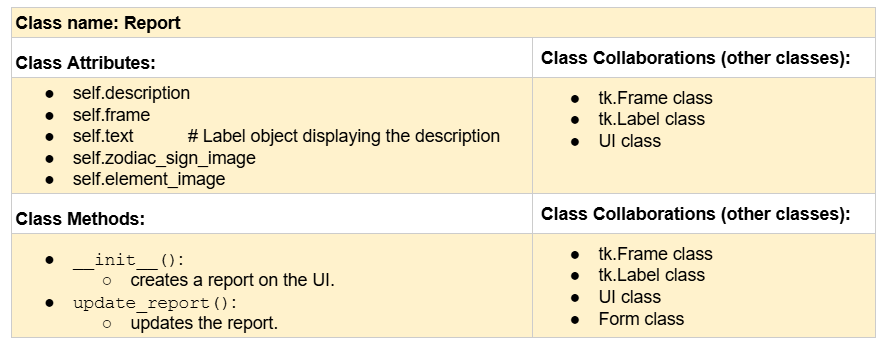
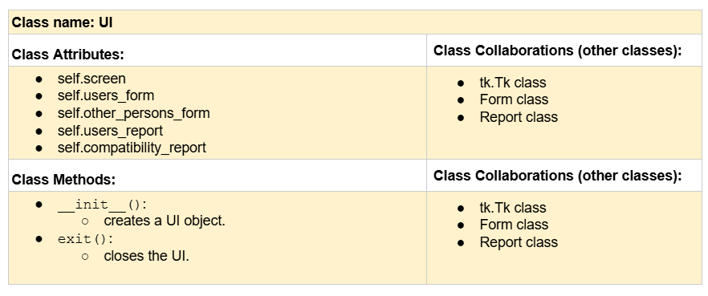

**Branches**: This project will **require** effective use of git. 

Each partner should create a branch at the beginning of the project, and stay on this branch (or branches of their 
branch) as they work. When you need to bring each others branches together, do so by merging each other's branches 
into your own, following the process we've discussed in previous assignments, then re-branching out from the merged code.  

```
    Branch 1 starting name: techap
    Branch 2 starting name: kurasova
```

### References 

❗Throughout this project, you will likely use outside resources. Reference all ideas which are not your own, 
and describe how you integrated the ideas or code into your program. This includes online sources, people who have 
helped you, AI tools you've used, and any other resources that are not solely your own contribution. Update this 
section as you go. DO NOT forget about it!

AbstractClasses.py: 
- Used the abc module: https://docs.python.org/3/library/abc.html
- Article on how to create abstract classes: https://www.w3schools.com/python/ref_module_abc.asp
- Chinese New Year Calendars:
  - https://www.themalatree.com/chinese-new-year-dates-1930-to-2030/
  - https://greenwichmeantime.com/chinese-new-year/1950/
  - https://taiwan-database.net/PDFs/WTFpdf23.pdf
- Fixing a circular import issue that occurred in this file: https://www.youtube.com/watch?v=UnKa_t-M_kM

Element.py: 
- Article on how to evaluate your element according to Chinese Metaphysics: https://shopceremonie.com/blog1/how-to-determine-your-elements

KuaNumber.py: 
- Video and article on how to calculate the Kua Number:
  - https://www.youtube.com/shorts/cy6r7imx4Uo
  - https://wehomzfurn.com/blogs/decoration-ideas/how-to-calculate-your-kua-number-a-complete-guide-for-2026


ZodiacSignCompatibility.py: 
- Used Wikipedia for the Zodiac Sign Compatibility table: https://en.wikipedia.org/wiki/Chinese_zodiac

---

## Milestone 2: Code Setup and Issue Queue

Most importantly, keep your issue queue up to date, and focus on your code. 🙃

Reflect on what you’ve done so far. How’s it going? Are you feeling behind/ahead? What are you worried about? 
What has surprised you so far? Describe your general feelings. Be honest with yourself; this section is for you, not me.

```
    - So far, we are making some progress towards the completion of the project. We're able to work as a team smoothly: we
      meet up at least twice a week to discuss the tasks we were assigned and synchronize our work, making sure that we're 
      both contributing to the project.
    - We think we're ahead.
    - We're worried about the design of the user interface.
    - Ultimately, we're feeling good about the project and working towards its effective completion.  
```

---

## Milestone 3: Virtual Check-In

Indicate what percentage of the project you have left to complete and how confident you feel. 

️**Completion Percentage**: `76%`

️**Confidence**: Describe how confident you feel about completing this project, and why. Then, describe some 
  strategies you can employ to increase the likelihood that you'll be successful in completing this project 
  before the deadline.

```
    - We are very confident about completing this project because we have made great progress so far. We're currently 
      working on the UI implementation phase, and everything seems to work pretty well. Whenever we encounter a problem, 
      we are able to think through it and devise a solution. 
    - For us to successfully complete this project, we need to dedicate more time and effort to it and meet up frequently 
      to work as a team. 
```

---

## Milestone 4: Final Code, Presentation, Demo

### User Instructions

In a paragraph, explain how to use your program. Assume the user is starting just after they hit the "Run" button 
in PyCharm.
```
    After hitting the run button, a form is displayed on the GUI that prompts the user to enter their name, date of 
    birth, and biological sex. When the user fills out the form, they have the option of submitting the form or adding 
    another form. If they click on the 'submit' button, their report will be displayed on the screen. This report contains 
    their Chinese zodiac sign, element, and kua numbers, as well as their pictorial representation and descriptions. If 
    they click on the 'add more' button, another form will be displayed on the GUI that prompts them to fill out the 
    information of the person they want to compare themselves with. After filling out the new form out, they can now proceed 
    to hitting the next submit button. Following this, a compatibility report of their zodiac sign, element, and kua 
    number will be displayed on the screen. They user can read the report to determine if they are a match with the other
    person or not, which brings the user to the end of the program. 
    
```

### Errors and Constraints

Every program has bugs or features that had to be scrapped for time. These bugs should be tracked in the issue queue. 
You should already have a few items in here from the prior weeks. Create a new issue for any undocumented errors and 
deficiencies that remain in your code. Bugs found that aren't acknowledged in the queue will be penalized.

### ❗Reflection

❗Each partner should write three to four well-written paragraphs address the following (at a minimum):
- Why did you select the project that you did?
- How closely did your final project reflect your initial design?
- What did you learn from this process?
- What was the hardest part of the final project?
- What would you do differently next time, knowing what you know now?
- How well did you work with your partner? What made it go well? What made it challenging?

```
    Partner 1: 
    The initial idea we had in mind when we started working on this project was to create a program that determines a user's 
    Chinese zodiac sign, element, and kua number, explain what each of them mean, and compare them to their beloved
    if they wish to. Also, if they are not compatible with their beloved, offer some tips that could help them live in 
    harmony. Looking at the final product we have, it is pretty much in line with what we had envisioned, except for giving
    the user tips if they are not compatible with they person they compared themselves with.
    
    Working on this project increased my communication and team work skills. Initially, I always preferred individual work,
    but this course as a whole and the project in particular made me understand the importance of effective communication 
    in teamwork and helped me to become a better team player. In regards to technical skills, this project made me relearn
    almost everything previously taught in this course, from if else statements to GUIs, and a lot more. It also enabled 
    me to better comprehend Git and GitHub, and how to use them professionally. Finally, one of the most important things 
    I learned throughout this process is the art of effective problem solving, from breaking down the problem into 
    manageable tasks to debugging.
    
    The hardest part of this project was the first step, applying top down design. It what challenging because it required
    great understanding of the project and knowledge of what the final product will look like without implementing any code.
    One thing I would have done differently is trying to understand everything on my own. Next time, I would ask my partner
    more questions about anything I do not understand and possibly seek help from TAs if still do not understand.
    
    Working with my partner was really effective because we always scheduled in-persons meetings where we dicussed our 
    ideas and made progressed together towards completing the project. Also, we closely monitored our progress and made 
    sure everyone was contributing to the project by completing their tasks on time.
```

```
    Partner 2: **Replace this with your reflection
```

---